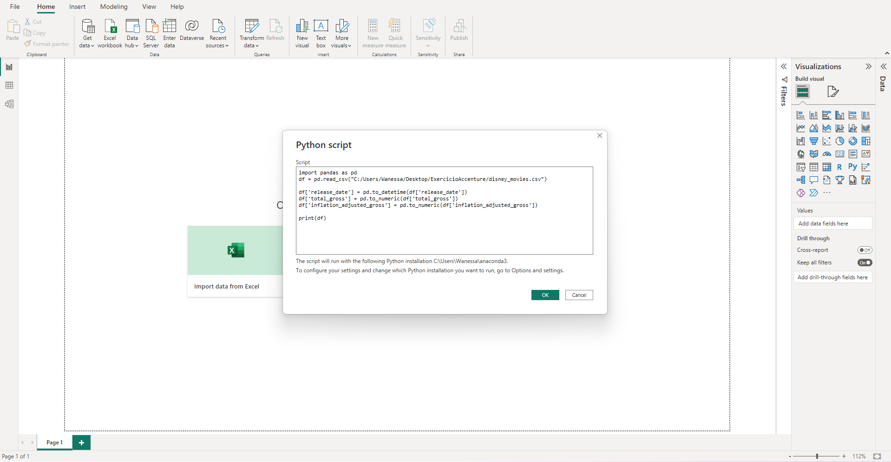
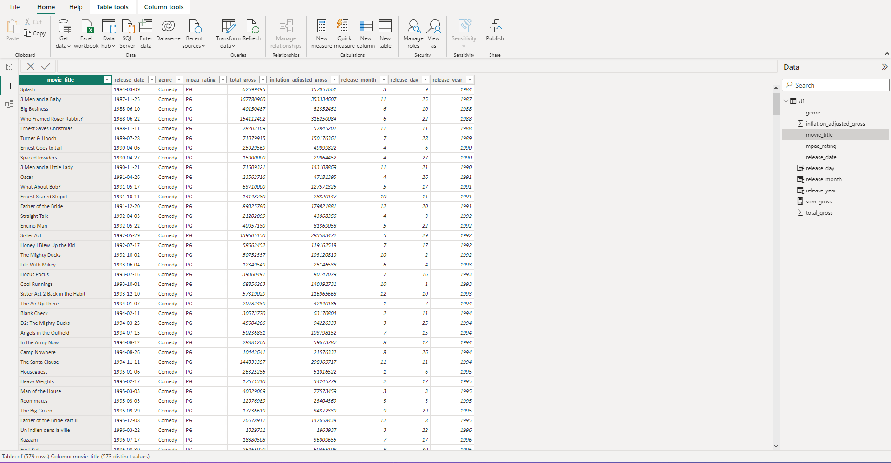

# exercicio_power_bi

## script python para transformar dados com a finalidade de usar as informações no PowerBI para gerar um relatório.

Nesse exercício foi utilizado um arquivo csv "disney_movies.csv" contendo dados sobre todos os filmes lançados pela empresa Disney.

Instalação: 

- Bibliotecas necessárias: Pandas, Matplotlib 
- Jupyter Notebook
- Python3.10

Utilizando um código em Python para conversão de dados, foi feita a alteração de tipos de alguns dados necessários para a manipulação no Power BI.

```python

import pandas as pd
df = pd.read_csv('disney_movies.csv')

df['release_date'] = pd.to_datetime(df['release_date'])
df['total_gross'] = pd.to_numeric(df['total_gross'])
df['inflation_adjusted_gross'] = pd.to_numeric(df['inflation_adjusted_gross'])

print(df)

```



Apos isso, foi realizado a inserção de dados diretamente no Power BI, gerando a seguinte tabela.



Por fim, foi gerada uma dashboard com os dados tratados.


 
